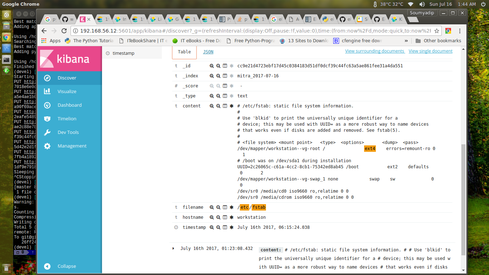

Mitra - a tool to make your infrastructure searchable using Elasticsearch
===================

This tool is to index all important information about your servers/OS/app and make them searchable from a centralized place. It uses [Elasticsearch](https://www.elastic.co) to index the documents.

----------


Use-cases:
---------------

 1. How many servers with 4.4 Linux kernel available in my infrastructure?
 2. How many servers do not have zsh installed?
 3. How many hosts with /etc/hosts size > 4k?
 4. What is the vm.swappiness setting across my infrastructure?
 ..and so on.
 
 Enjoy full power of [Lucene Search](https://www.elastic.co/guide/en/elasticsearch/reference/5.x/query-dsl-query-string-query.html#query-string-syntax) to get any data about your infrastructure
 
 Example search query:
  - Which hosts have ext4 filesystems
  `filename:"/etc/fstab" AND content:ext4`

How does it work:
-------------------------

The tool has two mode: indexer and searcher

**Indexer:** It's a service that runs on all machines. Config file specifies a frequency at which this service is going to read files (specified in the config file, you can add as many as you want). You can specify a maximum size of file; if any file greater than that size, it's ignored with an error log.

A new index is created per day. So you can search historical content/stat of the files. This is important if you're troubleshooting an issue and would like to historical content of files like `/etc/sysctl.conf`or `/proc/meminfo`

Document ID is determined from sha256 hash of host name and name of the file being indexed. This has an advantage while searching, for an example, if you want to see the content of `/etc/hosts` of `xyz`machine, you can directly search the file using it's id obtained from sha256 hash.

**Searcher:** (WIP) coming soon!

Config file:
---------------
```
log:
  file: /tmp/runner.log  # log file location
  maxsize: 10  # maximum log file size in MB
  level: info  # log level

indexer:
  prefix: mitra_  # index prefix
  es_host: ubuntu02  # elasticsearch node
  es_port: 9200  # elasticsearch port
  maxsize: 10  # maximum file size, -1 stands for no limit

files:  # list of files to index into elasticsearch
  - /etc/hosts
  - /etc/resolv.conf
  - /etc/sysctl.conf
  - /etc/security/limits.conf
  - /etc/ntp.conf
  - /etc/fstab
  - /tmp/pkgs
  - /proc/meminfo
  - /proc/version

frequency: 300  # how frequently the indexer runner should run, in seconds
```

Installation:
-----------------
```
python setup.py build
python setup.py install
```

How to run:
-----------------
**Indexer**:
```
runner -c config/runner.yaml
```

**Note**: You can also use [Kibana](https://www.elastic.co/products/kibana) to search through the indices

